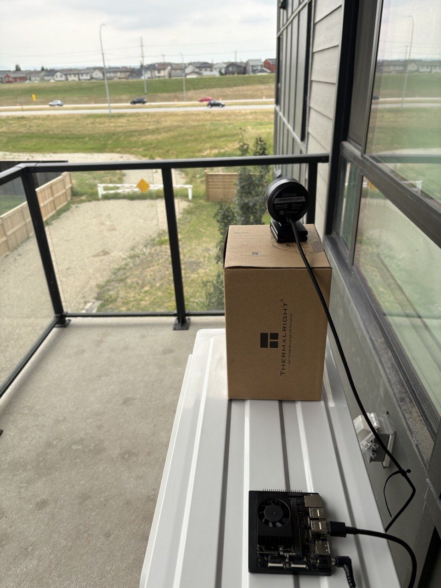
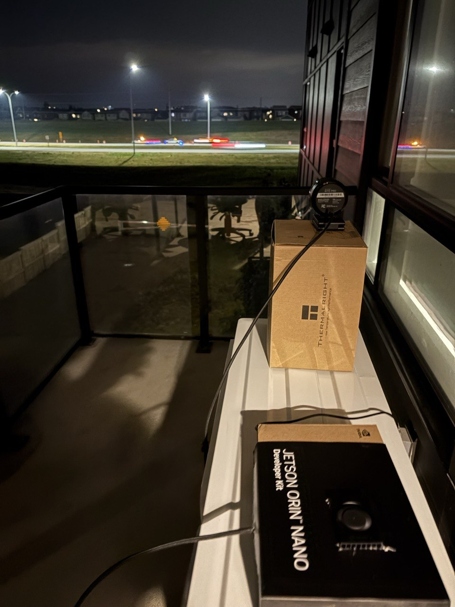

# AI Highway Speed Camera

Real-time computer vision system running on an **NVIDIA Jetson Orin Nano 8GB**. A fixed webcam observes highway traffic for vehicle detection, tracking, and speed estimation.

<p align="center">
  
  
</p>

## Data Collection

The first stage is collecting useful highway images for training.

Instead of saving every frame, `data_collector.py` monitors only the road region and saves a clean full-resolution image when meaningful motion is detected.


### Key Features

- **1080p / 60 FPS capture**
- **Road-only ROI** to ignore irrelevant parts of the scene
- **Motion-triggered saving** to avoid empty frames
- **Noise filtering** to reduce false triggers
- **Capture cooldown** to reduce near-duplicate images
- **Manual focus** for consistent image sharpness
- **Clean saved frames** with no preview overlays

The motion detector uses simple frame-to-frame differences inside the road ROI instead of running an AI model during collection. This keeps the process lightweight and fast on the Jetson.

## Run

```bash
python3 data_collector.py
```

Controls:

- `A / D` — adjust focus
- `S` — save the current frame manually
- `Q` or `ESC` — quit

Captured images are saved automatically to the `images/` directory.
